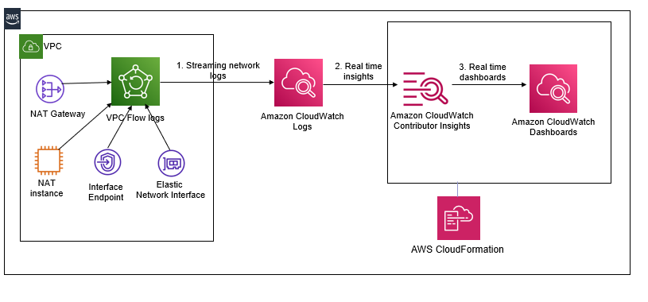

# Automate real time AWS network monitoring and visualizations using Amazon CloudWatch Contributor Insights

## Overview

1. Automates Real time visualization and monitoring of network bytes transferred via VPC endpoints, NAT Gateway and NAT instances. 
2. Provisions CloudWatch Contributor Insights Rules and CloudWatch Dashboard for network monitoring of VPC Flow logs

## Solution Design

## Prerequisites

1. Ensure that VPC Flow Logs are enabled for your VPC and configured to send log events to CloudWatch Logs.

## Install

1. 1-click automation. Launch the **[aws-databricks-cloudwatchcontributorinsights.yml](https://aws.amazon.com/s3/)** template. Provide input parameters:
	1. Name of the CloudWatch Log group that is configured for your VPC Flow Logs (Required)
	2. Network identifier for the Elastic Network Interface of your VPC Endpoint (Optional)
	2. Private IP address of the NAT Gateway (Optional)
	3. Private IP address of the NAT Instance (Optional)
	

## Validate
1. Login to your AWS Console and navigate to the [CloudWatch Dashboard](https://console.aws.amazon.com/cloudwatch/home?region=${AWS::Region}#dashboards:name=${DatabricksCWDashboard}) to view real time updates for sum of bytes transferred

