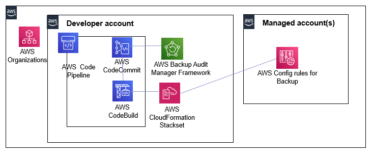

# Devops automation for backup compliance in AWS using AWS Backup Audit Manager

Integrates Backup Audit Manager with AWS CodePipeline, enabling developers to embed automated backup controls for AWS resources in their development workflows and shift left with backup compliance in AWS. A git check-in triggers CodePipeline to build, deploy and update AWS Backup Audit Manager framework controls to the managed accounts. The solution uses the Backup Audit Manager framework stackset in the developer account as the basis for provisioning stacks into selected managed accounts across specified AWS Regions. 

## Solution Architecture

## Prerequisites

1.	Enable AWS Config in the developer account as well as all of your managed accounts in the organization. Use AWS Systems Manager Quick Setup so you can accomplish it with just a few clicks from your console.
2.	Integrate AWS Cloud9 local Git repository with AWS CodeCommit remote Git repository
	1. Complete Step 1 from this AWS CodeCommit tutorial to create a CodeCommit Git repository. Provide a name for your CodeCommit Git repository (for example “BackupDevOps”). Note down the branch name (master, main etc) that you will use to check-in source code.
	2. Utilizing AWS Cloud9 is one of the easiest AWS methods for setting up a local Git repository and integrating with CodeCommit as the remote Git repository. Follow these steps to set up Cloud9 and integrate with a CodeCommit repository.
3. Download the following files from the GitHub repo and upload them to the root folder of your local cloned Cloud9 Git repository
	1. aws-backupcompliance-framework.yaml. This template provisions your Backup Audit Manager framework
	2. buildspec.yml   
	3. buildspec-updates.yml 
4.	In the following files available for download from the solution, substitute the [accountid] parameter with the AWS Account ID of the shared services account. Substitute the [region] parameter with your shared services account AWS Region. Substitute the [managedaccount] and [managedregion] parameters each with comma-separated AWS Account IDs and comma-separated AWS Regions of the managed accounts where the solution will be deployed.
	1. buildspec.yml
	2. buildspec-updates.yml
5.	Use standard git commands from your Cloud9 cloned repository's root folder (where the buildspec.yml file resides) in the Cloud9 console to check-in the source code from your local Cloud9 repository to the remote CodeCommit Git repository:
	1. git add .
	2. git commit -m "initial commit"
	3. git push origin
6.	Create an Amazon S3 staging bucket with this naming convention: s3-backupdevops-[accountid]-[region]. 

## Setup

1. Launch the aws-backupcompliance-codepipeline.yml CloudFormation Template. This template provisions the AWS CodePipeline based DevOps automation with AWS CodeCommit and AWS CodeBuild stages. It enables the build and deployment of your backup in specified accounts and regions of your organization. It takes the following parameters:
	1. RepositoryName: Name of the CodeCommit repository for the backup compliance templates. Obtain this value from step 2a of the prerequisites section.
	2. BranchName: Branch in the CodeCommit repository for the backup compliance templates. Obtain this value from step 2a of the prerequisites section.
	3. BackupComplianceStagingBucket: Backup Audit Manager framework template staging bucket. Obtain this value from step 6 of the prerequisites section.

## Test and Run

1. Test the evaluation of the BACKUP_RESOURCES_PROTECTED_BY_BACKUP_PLAN control that checks if AWS resources are protected by a backup plan. Launch an Amazon Aurora MySQL cluster that is not protected by a backup plan and validate that a backup compliance related finding is created for this now because our devops pipeline has provisioned a Backup Audit Manager framework in your AWS environment. Here are the steps to do this:
	1. Log in to the Amazon RDS console of your managed AWS account and launch an Amazon Aurora MySQL cluster. In the Choose a database creation method option choose Easy create and accept all default settings.
	2. Navigate to the AWS Backup console of your managed AWS account, select Backup plans from the left panel. Verify that there are no existing backup plans already configured in your account for your newly provisioned Aurora database by clicking on Resource assignments for each configured backup plan. 
	3. After a few minutes, navigate to the AWS Config console of your managed AWS account and you should see an AWS Config rule with a prefix “AURORA-RESOURCES_PROTECTED_BY_BACKUP_PLAN-“  that has been provisioned in your environment. Click on the rule and scroll down to Resources in scope and select Noncompliant from the toggle bar. You will see your Aurora database listed there.  

2. Next remediate the compliance finding by protecting our Aurora MySQL cluster with a Backup Plan. Create a backup plan from the console and assign the Aurora MySQL cluster to it. In the backup rule of your backup plan, set the Backup frequency to monthly and the Retention period to 8 days.
	1. In the root folder of your cloned Cloud9 Git repository, make a copy of your current buildspec.yml and aws-backupcompliance-framework.yml files. Rename buildspec-updates.yml to buildspec.yml. Download the aws-backupcompliance-framework-v1.yaml file, rename it as aws-backupcompliance-framework.yaml and upload it to the root folder of your cloned Cloud9 Git repository.
	2. Use standard git commands from your Cloud9 cloned repository's root folder (where the buildspec.yml file resides) in the Cloud9 console:
		1. git add .
		2. git commit -m "updates"
		3. git push origin

3. Let’s test our solution again by triggering a sample backup compliance finding that has been provisioned based on the updated template in the pipeline. Let’s assume that you have a requirement for daily backups with a retention period greater than 35 days for your Aurora MySQL cluster. To do this, you update your backup compliance CloudFormation template by adding a BACKUP_PLAN_MIN_FREQUENCY_AND_MIN_RETENTION_CHECK control that checks for non-compliant backup plans associated with backup rules that don’t satisfy the minimum required frequency (24 hrs) and minimum retention period (35 days) of our requirement. 
	1. Navigate to the AWS Config console of your managed AWS account and you should see an AWS Config rule with a prefix “BACKUP_PLAN_MIN_FREQUENCY_AND_MIN_RETENTION_CHECK“  that has been provisioned in your environment. Click on the rule and scroll down to Resources in scope and select Noncompliant from the toggle bar. You will see your backup plan associated with the Aurora MySQL cluster resource there.  

