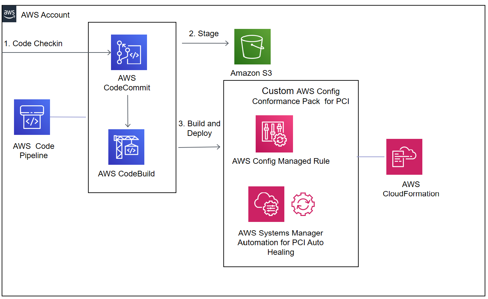

# DevSecOps for Auto Healing PCI Compliance using custom AWS Config Conformance Packs and AWS CodePipeline

Augments the AWS Config Conformance Pack for Operational Best Practices for PCI DSS 3.2.1 with 2 features –
1. Auto healing for PCI related AWS Config Managed rules. Adds Remediation to the PCI Conformance Packs. Implemented using Custom AWS Config Conformance Packs that leverage custom AWS Systems Manager Automation Documents provided via AWS CloudFormation
2.	DevSecOps CI/CD pipeline for PCI compliance that incorporates “PCI Compliance as code” in an existing DevOps workflows. Implemented via integrating AWS Custom Config Conformance Packs with AWS CodePipeline and provided via AWS CloudFormation.  

## How it Works

1. aws-pci-confpack-codepipeline.yml
- Triggers an AWS CodePipeline based CI/CD pipeline whenever there is an update to the source AWS CloudFormation templates in your local Git repository. These source AWS CloudFormation templates incorporate the code for the custom AWS Config Conformance Packs.
- Provisions an AWS CodePipeline automation with AWS CodeCommit and AWS CodeBuild stages for the build and deployment of the AWS Config Conformance Packs
2. aws-pci-confpack-ssmautomation-v1.yml
- Provisions custom AWS Systems Manager automation documents for PCI remediation. These documents are used to provide automated remediations within the provisioned AWS Config rule using the AWS:Config:RemediationConfiguration CloudFormation construct in the AWS Config Conformance Pack. 
- Provisions pre-requisites for the AWS Config Conformance Pack deployment such as the AWS Systems Manager automation role, S3 buckets for logging and replication for S3 related remediations and CloudWatch logs and CloudWatch role for AWS CloudTrail related remediations for PCI compliance
3. Custom AWS Config Conformance Packs
- aws-pci-conformancepack-v1-1.yml – Provisions a custom AWS Config Conformance Pack for the detection and remediation for Amazon EC2, AWS Auto Scaling and AWS Lambda based PCI Compliance violations
- aws-pci-conformancepack-v1-2.yml - Provisions a custom AWS Config Conformance Pack for the detection and remediation for AWS CloudTrail, AWS KMS and AWS CodeBuild based PCI Compliance violations 
- aws-pci-conformancepack-v1-3.yml - Provisions a custom AWS Config Conformance Pack for the detection and remediation for Amazon Redshift, AWS RDS and AWS IAM based PCI Compliance violations.

## Solution Design

## Prerequisites
1.	Custom AWS Config Conformance Packs - Set up prerequisites for deploying and building with both AWS Config Conformance Packs as well as custom AWS Config Conformance Packs with remediations. Refer to AWS documentation
2.	Local Git repository and AWS CodeCommit Git repository setup – Create an AWS CodeCommit Git Repository in your AWS account and integrate it with your local Git repository. Refer to AWS documentation.
3.	Staging S3 bucket – The solution consists of staging S3 bucket with the following naming convention: s3-pciautohealconfpack--accountid-region. Substitute these parameters in the buildspec.yml with your corresponding AWS Account ID and Region parameters. The buildspec.yml uses the staging S3 bucket as the template-s3-uri parameter while invoking the aws configservice put-conformance-pack cli.

## How To Install

1. **Template 1 of 2:** aws-pci-confpack-ssmautomation-v1.yml
* Sets up AWS Systems Manager Automation Documents for PCI related Auto Healing and the required PCI remediation related pre-requisites. No parameters needed. Installs in approx 2-3 mins.
 
2. **Template 2 of 2:** aws-pci-confpack-codepipeline.yml
* Sets up AWS CodePipeline based DevSecOps automation
* Installs aws-pci-conformancepack-v1-[1,2,3].yml for custom AWS Config Conformance Packs with Remediation for PCI

## COVERAGE

The [Coverage Matrix](https://github.com/kmmahaj/config/blob/master/aws-conformancepack-pci/coverage/AWS%20SecurityHub%20Benchmarks-Coverage-v1.xlsx) provides the current coverage of this solution wrt the PCI Benchmarks

## @kmmahaj
